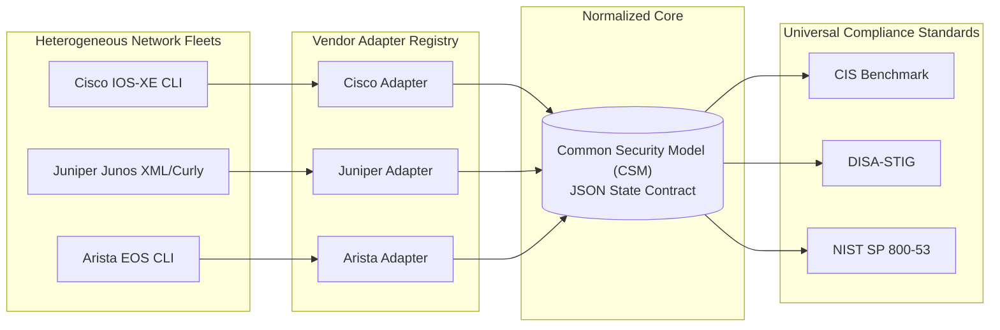
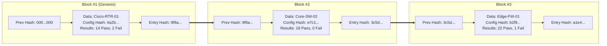

# NTRO PS26155 — System Architecture & Presentation Deck Reference

**Product:** AI-Driven Multi-Vendor Network Security Compliance Auditor  
**Problem Statement:** NTRO PS26155 (National Technical Research Organisation)  
**Classification / Environment:** Sovereign, Air-Gapped, Defense-Grade  
**Status:** MVP Implemented, Verified (780+ automated tests passing)  
**Evaluator Portal:** Standalone Product Landing Page (`/landing-page/` on port 3001)  
**Date:** September 2026  

---

## 1. Executive Summary & Design Philosophy

The NTRO PS26155 platform is an enterprise-grade, offline-first compliance auditing system engineered for mission-critical national infrastructure, military enclaves, and sovereign telecommunications networks. It automates the security auditing of heterogeneous network device configurations (Cisco IOS-XE, Juniper Junos, Arista EOS, Fortinet FortiOS) against authoritative compliance benchmarks:
- **CIS Benchmark** (Cisco IOS-XE 17.x v2.2.1)
- **DISA-STIG** (Cisco IOS-XE Router NDM STIG V3R7)
- **NIST SP 800-53 rev5** (via DoD CCIs)
- **ISO/IEC 27001:2022**

### The Three Foundational Pillars

```
+-------------------------------------------------------------------------------------------------+
|                                    THREE FOUNDATIONAL PILLARS                                   |
+--------------------------------+--------------------------------+-------------------------------+
|    1. DETERMINISTIC CORE       |    2. ADVISORY AI WITH HITL    |   3. MATHEMATICAL PROOF       |
|                                |                                |                               |
| All compliance verdicts        | Local-only SLMs assist with    | Append-only SHA-256           |
| (PASS/FAIL/UNKNOWN) are 100%   | unmapped syntax & plain-text   | hash-chained audit ledger     |
| deterministic Python rules.    | remediation explanations. Zero | provides cryptographic        |
| Zero probabilistic hallucination.| AI makes unapproved decisions.| non-repudiation & tamper check.|
+--------------------------------+--------------------------------+-------------------------------+
```

---

## 2. End-to-End System Architecture (PRD v7.0)

The platform follows a strictly decoupled, 7-layer pipeline designed for sub-10ms deterministic evaluation, air-gapped defense compliance, modular vendor expansion, and cryptographic proof of integrity.

```mermaid
flowchart TD
    classDef inputStyle fill:#1e293b,stroke:#475569,stroke-width:2px,color:#f8fafc;
    classDef adapterStyle fill:#0369a1,stroke:#0284c7,stroke-width:2px,color:#ffffff;
    classDef csmStyle fill:#0f766e,stroke:#14b8a6,stroke-width:2px,color:#ffffff;
    classDef evalStyle fill:#4338ca,stroke:#6366f1,stroke-width:2px,color:#ffffff;
    classDef aiStyle fill:#854d0e,stroke:#eab308,stroke-width:2px,color:#ffffff;
    classDef remedStyle fill:#7c2d12,stroke:#ea580c,stroke-width:2px,color:#ffffff;
    classDef ledgerStyle fill:#064e3b,stroke:#10b981,stroke-width:2px,color:#ffffff;
    classDef uiStyle fill:#18181b,stroke:#71717a,stroke-width:2px,color:#f4f4f5;

    subgraph INGESTION ["1. Unified Ingestion Layer (AST-Guarded)"]
        RAW["Raw Config Ingestion<br/>Single / Multi-File / Guarded ZIP"]:::inputStyle
        AST_GUARD{"Static AST Safety Sandbox<br/>Zero Sockets / Zero Paramiko / Zero Subprocess"}:::inputStyle
        DETECT["Fail-Closed Vendor Detector<br/>(Cisco / Junos / Arista / Palo Alto)"]:::adapterStyle
        
        RAW --> AST_GUARD --> DETECT
    end

    subgraph NORMALIZATION ["2. Normalization & Identity Layer"]
        ADAPTER["Vendor Adapter Registry<br/>Cisco IOS-XE / Junos / EOS (reuse) / PAN-OS"]:::adapterStyle
        DEVID["Device Identity Extractor<br/>Serial, Model, OS, Mgmt IP ('Not In Config')"]:::adapterStyle
        CSM[("Common Security Model (CSM v7 JSON Schema)<br/>interfaces, services, aaa, logging, ntp, routing, device")]:::csmStyle
        UNMAPPED["Unmapped Syntax Lines<br/>(Unknown / Vendor-Specific CLI)"]:::aiStyle
        
        DETECT --> ADAPTER
        ADAPTER --> DEVID --> CSM
        ADAPTER --> UNMAPPED
    end

    subgraph ENGINE ["3. Deterministic Compliance Engine"]
        BASELINE["Vendor Baseline Rules<br/>(Cisco 10, Junos 10, Arista, PAN-OS)"]:::evalStyle
        REGISTRY["Framework Registry & Evaluators"]:::evalStyle
        CIS["CIS Benchmark Evaluator<br/>(v2.2.1 Controls)"]:::evalStyle
        STIG["DISA-STIG Evaluator<br/>(V3R7 Controls)"]:::evalStyle
        CROSSWALK["Generic Crosswalk Evaluator<br/>NIST SP 800-53 rev5 & ISO/IEC 27001:2022"]:::evalStyle
        AGG["Compliance Aggregator & Roll-Up<br/>PASS / FAIL / UNKNOWN (+ NOT_ASSESSED)"]:::evalStyle
        
        CSM --> BASELINE --> REGISTRY
        REGISTRY --> CIS & STIG & CROSSWALK
        CIS & STIG & CROSSWALK --> AGG
    end

    subgraph HITL ["4. Advisory AI & Human-in-the-Loop (HITL)"]
        LOCAL_AI["Advisory Local AI Engine<br/>DistilBERT (Mapping) + Ollama SLM (Rationale)"]:::aiStyle
        FALLBACK["Deterministic Template Fallback<br/>(Zero AI Verdict Authority)"]:::aiStyle
        QUEUE["Pending Suggestions Queue<br/>(pending_suggestions in SQLite)"]:::aiStyle
        REVIEWER{"Authorized Human Reviewer<br/>Approve / Correct / Reject"}:::aiStyle
        TRUSTED[("Trusted Rule Library<br/>trusted_mappings (Learns Stored Rules, Not Weights)")]:::csmStyle

        UNMAPPED --> LOCAL_AI
        LOCAL_AI -. "On Refusal / Timeout" .-> FALLBACK
        LOCAL_AI & FALLBACK --> QUEUE
        QUEUE --> REVIEWER
        REVIEWER -- "Approved / Corrected" --> TRUSTED
        TRUSTED -. "Future Audits" .-> BASELINE
        REVIEWER -- "Rejected" --> DISCARD["Audit Log / Discard"]:::aiStyle
    end

    subgraph REMEDIATION ["5. Central Remediation & Conflict Analysis"]
        REG_REMED["Central Remediation Registry<br/>(BASELINE_REMEDIATION_REGISTRY - Display Only)"]:::remedStyle
        RESOLVE["Rule-to-Baseline Resolver<br/>(CIS & STIG Map to Baseline Fixes)"]:::remedStyle
        CONFLICT["Static Conflict Analyzer<br/>Contradiction, Shadowing, Overlap Checks"]:::remedStyle

        AGG --> RESOLVE --> REG_REMED
        REG_REMED --> CONFLICT
    end

    subgraph PROOF ["6. Cryptographic Ledger & Audit Non-Repudiation"]
        BLOCK["Append-Only Ledger Engine<br/>SHA-256 Hash Chaining: H(n) = SHA256(Block_n + H(n-1))"]:::ledgerStyle
        LEDGER_DB[("SQLite Audit Store<br/>audit_ledger Table")]:::ledgerStyle
        VERIFY["Cryptographic Verifier<br/>Instant Bit-Level Tamper Detection"]:::ledgerStyle

        AGG & CONFLICT --> BLOCK
        BLOCK --> LEDGER_DB
        LEDGER_DB --> VERIFY
    end

    subgraph PRESENTATION ["7. Canonical Reporting & RBAC Interfaces"]
        REPORT_MODEL["Canonical Editable Report Model<br/>Immutable Verdicts vs Editable Commentary"]:::uiStyle
        API["FastAPI REST & Report API<br/>JWT RBAC: Viewer, Uploader, Reviewer"]:::uiStyle
        EXPORTER["Canonical Exporter (report_exporter.py)<br/>Certified PDF & DOCX Dossiers"]:::uiStyle
        UI["Role-Based Web Interface<br/>Viewer Dashboard | Uploader Batch | Reviewer Workspace"]:::uiStyle

        BLOCK & REPORT_MODEL --> API
        API --> UI
        API --> EXPORTER
    end
```



---

## 3. High-Impact Presentation Deck Slide Blueprint

For presenting the architecture in executive, technical, or hackathon evaluation decks, use the following slide-by-slide sequence.

---

### Slide 1: Platform Overview & Macro Architecture

#### Slide Title
**NTRO PS26155: Sovereign, Air-Gapped Multi-Vendor Network Compliance Platform**

#### Visual Layout (16:9 Widescreen)
- **Top Bar**: Problem Statement (NTRO PS26155) | Air-Gapped Execution | Sub-10ms Deterministic Auditing.
- **Center Visual**: The 7-Layer Architecture Diagram (from Ingestion to Tamper-Evident PDF).
- **Bottom Callout Cards**:
  - **Zero Cloud Egress**: 100% local CPU/GPU execution; zero telemetry leaks.
  - **Dual-Hemisphere Engine**: Deterministic compliance rules separated from advisory AI.
  - **Cryptographic Chaining**: SHA-256 immutable audit ledger with mathematical tamper-detection.

#### Speaker Notes / Talking Points
> "Good morning/afternoon, esteemed judges. We are presenting our architecture for NTRO Problem Statement 26155: an AI-driven, multi-vendor network compliance auditor. In high-security defense and national infrastructure networks, you cannot send device configurations to foreign cloud APIs, nor can you trust a probabilistic LLM to guess whether a router interface is compliant. Our platform solves this with a two-hemisphere architecture: a sub-10ms deterministic compliance core that evaluates normalized device models against CIS and DISA-STIG, paired with an offline advisory AI and human-in-the-loop workflow for unmapped directives, backed by a cryptographic SHA-256 audit ledger that guarantees mathematical non-repudiation."

---

### Slide 2: Vendor Decoupling & The Common Security Model (CSM)

#### Slide Title
**Eliminating $M \times N$ Complexity: The Canonical Common Security Model**

#### Visual Diagram



#### Key Architecture Points
- **The $M \times N$ Dilemma**: Directly mapping 3 vendors to 3 standards requires 9 separate scanners. Adding 2 more vendors requires 6 more parsers.
- **The CSM Solution**: Parsers normalize to a standardized Common Security Model (CSM) schema.
- **Standardized Facets**:
  - `interfaces` (administrative status, unused port shutdown, IP binding)
  - `services` (SSH v2, Telnet disablement, HTTP/HTTPS secure server)
  - `aaa` (authentication, authorization, accounting, TACACS+/RADIUS)
  - `logging` (syslog host, buffer sizes, trap severity levels)
  - `ntp` (authenticated peers, MD5/SHA keys)
  - `routing` (BGP neighbor authentication, prefix-list filters)
  - `snmp` (v3 SHA/AES users, exclusion of public/private community strings)
- **Extension Guarantee**: Onboarding a new vendor requires only one parser adapter. The entire compliance engine, reporting, and audit ledger remain untouched.

---

### Slide 3: The Two-Hemisphere Model — Deterministic Core vs. Advisory AI

#### Slide Title
**Defense-Grade AI: Zero Probabilistic Decision-Making in the Audit Path**

#### Comparison Visual

| Capability | Left Hemisphere: Deterministic Core | Right Hemisphere: Advisory AI Subsystem |
| :--- | :--- | :--- |
| **Component** | `compliance_framework.py`, `cis_benchmark_*`, `disa_stig_*` | `ai_suggester.py`, `ai_model_manager.py` |
| **Role** | Authoritative PASS / FAIL / UNKNOWN verdicts | Unmapped CLI interpretation & plain-text explanations |
| **Technology** | Pure Python condition resolution on CSM schema | Local DistilBERT (66M) + Local Ollama (Llama 3 / Mistral) |
| **Runtime Target** | < 10 milliseconds (CPU standard library) | Asynchronous background suggestion queue |
| **Authority** | Final, binding compliance certificate generation | Draft suggestions ONLY; Zero write access to active rules |
| **Gatekeeper** | Mathematical logic | Human Security Officer (Reviewer Approval Required) |

#### Speaker Notes / Talking Points
> "A key architectural question was: Why not let an LLM audit the config directly? In defense enclaves, that is an unacceptable liability. An LLM can hallucinate, drift, or miss a single port vulnerability. In our system, the compliance decision is 100% deterministic code. We restrict AI to where it provides genuine leverage: reading unknown, proprietary commands that the parser has never seen, inferring their security category, and proposing a draft rule to a human security officer. The human approves or rejects it. The AI cannot approve its own suggestions. This is true defense-grade AI."

---

### Slide 4: Cryptographic Non-Repudiation — SHA-256 Audit Ledger

#### Slide Title
**Mathematical Proof of Integrity: SHA-256 Hash-Chained Audit Ledger**

#### Ledger Chaining Diagram



#### Security Guarantees
1. **Immutable Chaining**: Each audit entry incorporates the SHA-256 hash of the previous block, timestamp, device identifier, raw configuration SHA-256 hash, and evaluation verdict summary.
2. **Canonical Serialization**: Uses sorted, compact JSON serialization (`separators=(',', ':')`) to guarantee cross-architecture reproducibility.
3. **Instant Tamper Verification**: Any manual modification of a historical row (e.g. changing a `Fail` to a `Pass` in SQLite) causes a cryptographic chain break detectable in < 1ms by `verify_chain()`.
4. **Physical Certificate Binding**: Generated PDF certificates embed a vector QR code with the block's `entry_hash`, enabling physical-to-digital validation in the field.

---

### Slide 5: Safe Remediation & Defense-in-Depth AST Sandboxing

#### Slide Title
**Automated Safe Remediation with Static AST Injection Defense**

#### Workflow Visual
```
Rule Failure (e.g. CISCO-NTP-001)
               │
               ▼
Parameterized Jinja2 Template (`templates/remediation/CISCO-NTP-001.j2`)
               │
               ▼
Static AST Safety Sandbox (`ast_safety.py`)
       ├── Blocks `__import__`, `eval`, `exec`, `open`, `compile`
       ├── Blocks unauthorized modules (`os`, `sys`, `subprocess`, `socket`)
       └── Rejects private dunder attributes (`__globals__`, `__subclasses__`)
               │
               ▼ PASS
Static Conflict Analyzer (`remediation_engine.py`)
       └── Verifies no conflicting CLI commands against active running state
               │
               ▼
Display-Only Remediation Block & Explanations (Zero Automated Device Side-Effects)
```

---

## 4. Subsystem Deep Dive & Component Specifications

| Subsystem | Source Module | Primary Functions & Invariants |
| :--- | :--- | :--- |
| **Ingestion & Adapters** | `src/vendor_adapter.py`<br/>`src/vendor_registry.py`<br/>`src/cisco_auditor.py`<br/>`src/juniper_auditor.py` | Detects vendor syntax via heuristic signatures or explicit input. Parses raw lines into structured AST/dict, separating unmapped lines cleanly into `unmapped_lines`. |
| **Common Security Model** | `config/Rule_Library/normalized_config_schema.json` | Strongly typed contract defining standardized network security state across interfaces, management services, AAA, logging, NTP, routing, and SNMP. |
| **Deterministic Evaluators** | `src/compliance_framework.py`<br/>`src/cis_benchmark_cisco_iosxe.py`<br/>`src/disa_stig_cisco_iosxe.py` | Evaluates normalized CSM against benchmark catalogs. Emits structured `EvaluationResult` objects with factual `Evidence` (observed value, location, expected value, rationale). |
| **Scoring & Aggregator** | `src/compliance_aggregator.py` | Calculates overall and per-framework compliance scores, deduplicates overlapping controls across CIS/STIG/NIST, and flags conflicting security recommendations. |
| **AI Subsystem (HITL)** | `src/ai_model_manager.py`<br/>`src/ai_suggester.py` | Local hardware probe (NVIDIA CUDA / CPU threads). DistilBERT semantic interpreter for unmapped lines. Maintains `pending_suggestions.json` and `trusted_mappings.json`. |
| **Remediation Engine** | `src/remediation_engine.py`<br/>`src/ast_safety.py` | Jinja2 parameterized CLI remediation generation. Validates templates with Python AST analysis. Enforces display-only semantics to prevent unauthorized network changes. |
| **Audit Ledger** | `src/audit_log.py`<br/>`src/database.py` | Append-only SHA-256 hash chaining stored in SQLite `audit_ledger`. Provides tamper verification and verifiable non-repudiation. |
| **API & Security** | `src/main.py`<br/>`src/auth.py` | FastAPI application exposing 16 REST endpoints. Pure Python HS256 JWT auth and PBKDF2 password hashing with role-based access control (Admin, Auditor, Reviewer). |
| **Export Engine** | `src/report_exporter.py`<br/>`src/report_generator.py` | Generates tamper-verifiable PDF certificates embedding vector QR codes and comprehensive multi-framework DOCX compliance audit dossiers. |
| **Frontend UI** | `frontend/src/*` (React + Vite + TS) | Interactive cybersecurity dashboard with dark/light themes, live audit visualizer, telemetry cards, ledger tamper verifier, and suggestion review portal. |

---

## 5. Architectural Invariants & Guarantees

1. **Air-Gap Invariant**: No outbound network requests are initiated by the backend under any circumstances. External cloud LLM APIs (OpenAI, Anthropic) are completely excluded from dependencies and execution paths.
2. **Determinism Invariant**: Running an audit against a device configuration will produce identical verdicts every single time. Compliance statuses are strictly `PASS`, `FAIL`, or `UNKNOWN`.
3. **Preservation of UNKNOWN**: An unmapped or indeterminate configuration line is marked `UNKNOWN` and is **never** silently coerced into `FAIL` or `PASS`.
4. **Human Review Gate**: AI suggestions remain in `pending_suggestions.json` until an authenticated human reviewer explicitly approves or edits them into `trusted_mappings.json`.
5. **Ledger Immutability**: Any modification to historical records in `audit_ledger` immediately invalidates the cryptographic hash chain.

---

## 6. ADR Traceability Matrix

All foundational architectural decisions are formally documented in Architecture Decision Records:

| Decision Area | ADR Document | Core Architectural Principle |
| :--- | :--- | :--- |
| **Evaluation Integrity** | [ADR-001](decisions/ADR-001-deterministic-compliance-decoupled-from-ai.md) | Decouple compliance verdicts from probabilistic AI. |
| **Multi-Vendor Scalability** | [ADR-002](decisions/ADR-002-common-security-model-vendor-abstraction.md) | Standardize configuration representation in Common Security Model. |
| **Unmapped Directive Handling** | [ADR-003](decisions/ADR-003-human-in-the-loop-ai-unmapped-pipeline.md) | Staged Human-in-the-Loop review queue for AI-suggested mappings. |
| **Audit Non-Repudiation** | [ADR-004](decisions/ADR-004-sha256-hash-chained-audit-ledger.md) | Append-only SHA-256 hash chaining with vector QR code binding. |
| **Air-Gap & Code Safety** | [ADR-005](decisions/ADR-005-air-gapped-local-execution-and-ast-sandboxing.md) | Local hardware model execution and static Python AST sandboxing. |
