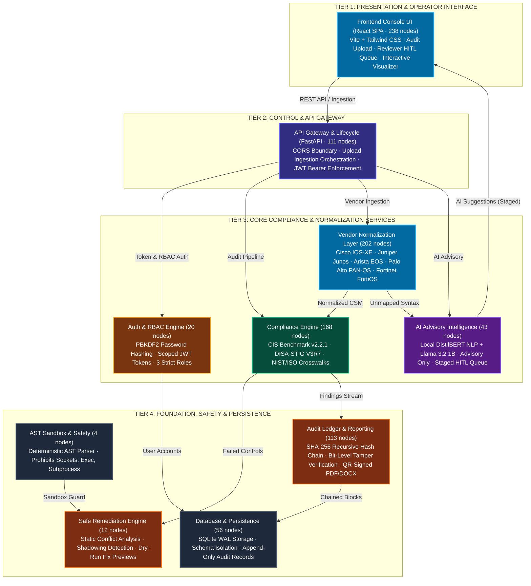
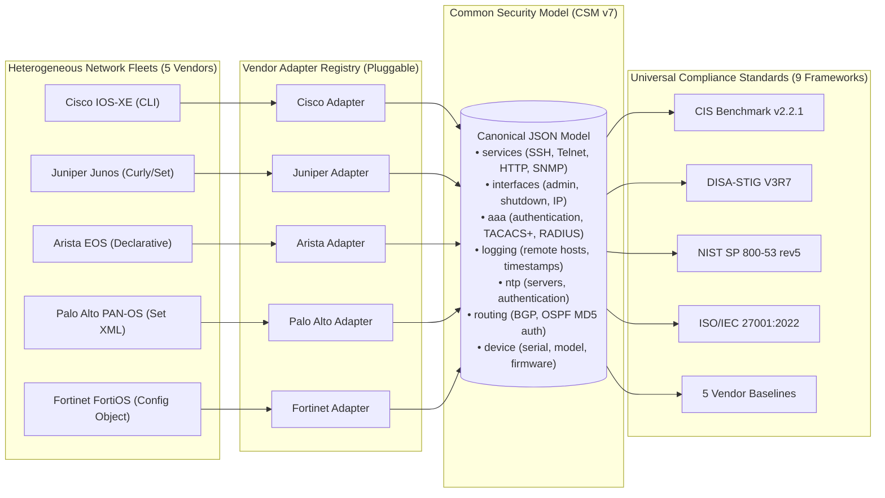
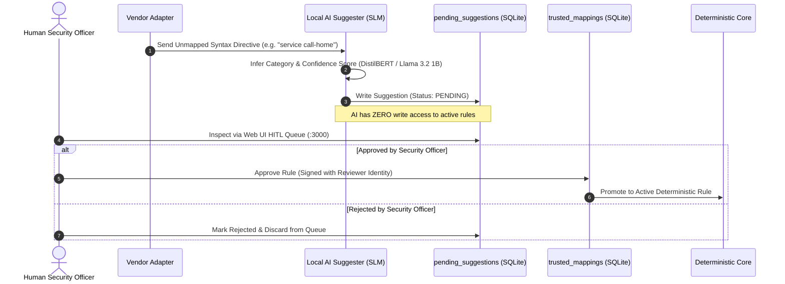

# NTRO PS26155 — System Architecture Document
## 2-Page Visual Architecture Dossier (Defense-Grade & Jury-Ready)

> **Document Class:** Sovereign Defense-Grade Architecture Specification  
> **Problem Statement:** NTRO PS26155 — AI-Driven Multi-Vendor Network Security Compliance Auditor  
> **Environment:** Air-Gapped / Isolated Enclaves (Zero Cloud Egress / No Outbound Sockets)  
> **Key Standards:** CIS Benchmark v2.2.1 | DISA-STIG V3R7 | NIST SP 800-53 rev5 | ISO/IEC 27001:2022  
> **Verification Status:** 780+ Automated Tests Passing | Sub-Millisecond Evaluation Latency (~0.33ms)  
> **Evaluator Portal:** Standalone Product Landing Page (`/landing-page/` on port 3001)  
> **Knowledge Graph:** Verified 4-Tier Knowledge Graph (2,744 Nodes, 5,213 Edges, 177 Communities, 101 Files)

---

<!-- ============================================================================================== -->
<!-- PAGE 1: MACRO SYSTEM ARCHITECTURE & 4-TIER PIPELINE DIAGRAM                                    -->
<!-- ============================================================================================== -->
<div id="page-1" style="page-break-after: always; min-height: 100vh;">

### [PAGE 1] Macro System Architecture & End-to-End Pipeline

```
+---------------------------------------------------------------------------------------------------+
|                                      JURY EVALUATION SUMMARY                                      |
+--------------------------+--------------------------+-----------------------+---------------------+
|      ⚡ LATENCY          |       🔒 SECURITY        |     🛡️ INTEGRITY      |    🎯 TEST SUITE    |
|   ~0.33ms per device     |   100% Air-Gapped        |  Append-only SHA-256  |  780+ Automated     |
|   (65µs rule evaluation) |   Zero Cloud Egress      |  hash-chained ledger  |  tests passing      |
+--------------------------+--------------------------+-----------------------+---------------------+
```

#### 1. The Three Foundational Pillars

```
+-----------------------------------+------------------------------------+--------------------------------+
|     1. DETERMINISTIC CORE         |      2. ADVISORY AI WITH HITL      |    3. MATHEMATICAL PROOF       |
| Pure Python condition engine on   | Local SLMs interpret unmapped CLI  | Append-only SHA-256            |
| normalized CSM. Zero hallucinated | & draft remediations. Zero write   | hash-chained audit ledger      |
| verdicts (PASS / FAIL / UNKNOWN). | access to active rule database.    | guarantees non-repudiation.    |
+-----------------------------------+------------------------------------+--------------------------------+
```

#### 2. Master System Architecture: 4-Tier Pipeline



#### 3. Core Subsystem Responsibilities (At A Glance)

| Subsystem | Key Modules | Technology Stack | Core Sovereign Invariant |
| :--- | :--- | :--- | :--- |
| **Ingestion & Safety** | `src/ast_safety.py`, `src/vendor_registry.py` | Python AST, Magic Bytes | Static AST safety sandbox; zero socket, shell, or remote execution imports allowed. |
| **Vendor Normalization** | `src/vendor_adapters/*`, `src/device_identity.py` | 5 Vendor Adapters, JSON Schema | Decouples Cisco, Juniper, Arista, Palo Alto, and Fortinet into canonical CSM JSON. |
| **Compliance Engine** | `src/compliance_framework.py`, `src/cis_benchmark_*` | Pure Python Evaluators | Sub-millisecond evaluation (0.065ms/rule); strictly deterministic PASS, FAIL, UNKNOWN. |
| **Advisory AI (HITL)** | `src/ai_suggester.py`, `src/ai_model_manager.py` | DistilBERT, Llama 3.2 1B, SQLite | Zero write authority; suggestions remain staged until human reviewer cryptographically approves. |
| **Cryptographic Ledger** | `src/audit_log.py`, `src/database.py` | SHA-256 Recursive Chaining | Monotonically chained audit blocks; detects single-bit tampering across historical records in <1ms. |
| **Reporting & RBAC** | `src/report_exporter.py`, `src/auth.py`, `frontend/` | FastAPI, React, ReportLab | 3 sovereign roles (Reviewer, Uploader, Viewer); QR-embedded tamper-evident PDF dossiers. |

</div>

---

<!-- ============================================================================================== -->
<!-- PAGE 2: DEEP-DIVE MECHANISM DIAGRAMS & ADR MATRIX                                              -->
<!-- ============================================================================================== -->
<div id="page-2" style="min-height: 100vh;">

### [PAGE 2] Deep-Dive Mechanism Diagrams & Security Architecture

#### 4. Multi-Vendor Decoupling: Solving $M \times N$ Complexity via CSM v7


* **Architectural Invariant:** Adding a 6th vendor requires only **1 parser adapter**. All compliance evaluators, scoring logic, and report exporters remain 100% untouched.

---

#### 5. Dual-Hemisphere & Human-in-the-Loop (HITL) AI Architecture


* **Security Invariants:** Zero autonomous rule promotion. Unmapped lines remain evaluated as `UNKNOWN` until an authorized human signs off.

---

#### 6. Mathematical Non-Repudiation: SHA-256 Recursive Hash Chaining

```mermaid
flowchart LR
    subgraph B1 ["Block #1 (Genesis)"]
        P1["Prev Hash: 0000...0000"]
        D1["Payload: EDGE-RTR-01<br/>Config SHA: 4a2b...<br/>Verdict: COMPLIANT (10P/0F)"]
        H1["Block Hash: 8f3a9e..."]
        P1 --> D1 --> H1
    end

    subgraph B2 ["Block #2"]
        P2["Prev Hash: 8f3a9e..."]
        D2["Payload: CORE-SW-02<br/>Config SHA: 9b1c...<br/>Verdict: NON-COMPLIANT (8P/2F)"]
        H2["Block Hash: a1b2c3..."]
        P2 --> D2 --> H2
    end

    subgraph B3 ["Block #3"]
        P3["Prev Hash: a1b2c3..."]
        D3["Payload: FW-EDGE-01<br/>Config SHA: 3d5e...<br/>Verdict: COMPLIANT (12P/0F)"]
        H3["Block Hash: e7f809..."]
        P3 --> D3 --> H3
    end

    subgraph VERIFICATION ["Physical & API Verification"]
        QR["Vector QR Code on PDF"]
        API["GET /api/audit-log/verify"]
    end

    H1 ==> P2
    H2 ==> P3
    H3 -.-> QR
    H3 -.-> API
```


* **Chaining Formula:** $\text{Block\_Hash}_n = \text{SHA-256}\Big(\text{Block}_n.\text{payload} \,\|\, \text{Block\_Hash}_{n-1} \,\|\, \text{Timestamp}\Big)$
* **Tamper Proof:** Recomputing the chain verifies all historical blocks in **<1ms**. A single bit change invalidates the cryptographic sequence immediately.

---

#### 7. Defense-in-Depth: Static AST Sandboxing Workflow

```
Remediation / Parsing Script
         │
         ▼
[ Static AST Safety Analyzer (ast_safety.py) ]
         ├── BLOCKS Dangerous Builtins : `__import__`, `eval`, `exec`, `open`, `compile`
         ├── BLOCKS Prohibited Modules : `os`, `sys`, `subprocess`, `socket`, `pty`, `paramiko`
         └── BLOCKS Dunder Attributes  : `__globals__`, `__subclasses__`, `__code__`
         │
         ▼ PASS
[ Static Conflict Analyzer (remediation_engine.py) ]
         └── Verifies zero conflicting CLI directives against device running state
         │
         ▼
[ Display-Only CLI Preview & Plain-Language Explanation (Zero Autonomous Execution) ]
```

---

#### 8. Architecture Decision Records (ADR) Summary Matrix

| ADR ID | Decision Scope | Adopted Architecture | Why Chosen Over Alternatives |
| :--- | :--- | :--- | :--- |
| **ADR-001** | Evaluation Engine | 100% Deterministic Python rules on CSM. | Eliminates LLM hallucination, verdict drift, and regulatory unreliability. |
| **ADR-002** | Multi-Vendor | Canonical Common Security Model (CSM v7). | Replaces $M \times N$ custom rule explosion with linear $M+N$ complexity. |
| **ADR-003** | Unmapped Directives | Staged queue with Human Reviewer sign-off. | Prohibits unvetted AI suggestions from entering production rule catalogs. |
| **ADR-004** | Non-Repudiation | Append-only SHA-256 hash-chained SQLite ledger. | Zero-overhead mathematical proof without heavy blockchain infrastructure. |
| **ADR-005** | Sovereign Isolation | Local SLMs + Static AST Sandboxing. | Guarantees zero cloud data exfiltration and zero remote code execution. |

</div>
