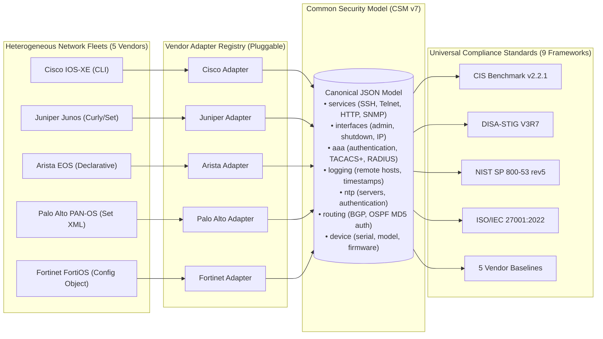
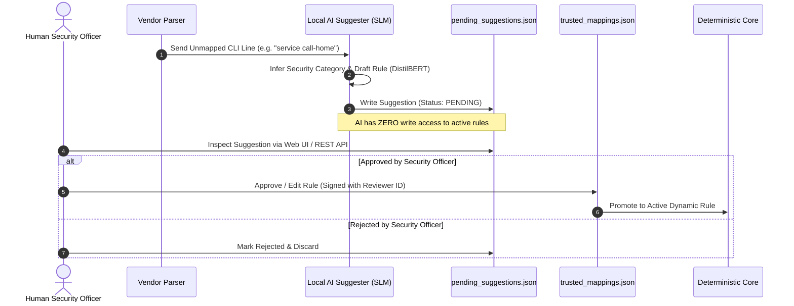

# NTRO PS26155 — System Architecture Document
## 2-Page Visual Architecture Dossier (Defense-Grade & Jury-Ready)

> **Document Class:** Sovereign Defense-Grade Architecture Specification  
> **Problem Statement:** NTRO PS26155 — AI-Driven Multi-Vendor Network Security Compliance Auditor  
> **Environment:** Air-Gapped / Isolated Enclaves (Zero Cloud Egress)  
> **Key Standards:** CIS Benchmark v2.2.1 | DISA-STIG V3R7 | NIST SP 800-53 rev5 | ISO/IEC 27001:2022  
> **Verification Status:** 780+ Automated Tests Passing | Sub-Millisecond Evaluation Latency (~0.33ms)  
> **Evaluator Portal:** Standalone Product Landing Page (`/landing-page/` on port 3001)  

---

<!-- ============================================================================================== -->
<!-- PAGE 1: MACRO SYSTEM ARCHITECTURE & 7-LAYER PIPELINE DIAGRAM                                    -->
<!-- ============================================================================================== -->
<div id="page-1" style="page-break-after: always; min-height: 100vh;">

### [PAGE 1] Macro System Architecture & End-to-End Pipeline

```
+---------------------------------------------------------------------------------------------------+
|                                      JURY EVALUATION SUMMARY                                      |
+--------------------------+--------------------------+-----------------------+---------------------+
|      ⚡ LATENCY          |       🔒 SECURITY        |     🛡️ INTEGRITY      |    🎯 TEST SUITE    |
|   ~0.33ms per device     |   100% Air-Gapped        |  Append-only SHA-256  |  780+ Automated     |
|   (65µs rule evaluation) |   Zero Cloud Egress      |  hash-chained ledger  |  tests passing      |
+--------------------------+--------------------------+-----------------------+---------------------+
```

#### 1. The Three Foundational Pillars

```
+-----------------------------------+------------------------------------+--------------------------------+
|     1. DETERMINISTIC CORE         |      2. ADVISORY AI WITH HITL      |    3. MATHEMATICAL PROOF       |
| Pure Python condition engine on   | Local SLMs interpret unmapped CLI  | Append-only SHA-256            |
| normalized CSM. Zero hallucinated | & draft remediations. Zero write   | hash-chained audit ledger      |
| verdicts (PASS / FAIL / UNKNOWN). | access to active rule database.    | guarantees non-repudiation.    |
+-----------------------------------+------------------------------------+--------------------------------+
```

#### 2. Master System Architecture Diagram (PRD v7.0)

> 🖥️ **16:9 Widescreen Vector SVG**: [Download / Open 16:9 SVG](ARCHITECTURE_DIAGRAM_16_9.svg) | [Interactive 16:9 Slide Viewer](ARCHITECTURE_DIAGRAM_16_9.html)

```mermaid
flowchart TD
    classDef inputStyle fill:#1e293b,stroke:#475569,stroke-width:2px,color:#f8fafc;
    classDef adapterStyle fill:#0369a1,stroke:#0284c7,stroke-width:2px,color:#ffffff;
    classDef csmStyle fill:#0f766e,stroke:#14b8a6,stroke-width:2px,color:#ffffff;
    classDef evalStyle fill:#4338ca,stroke:#6366f1,stroke-width:2px,color:#ffffff;
    classDef aiStyle fill:#854d0e,stroke:#eab308,stroke-width:2px,color:#ffffff;
    classDef remedStyle fill:#7c2d12,stroke:#ea580c,stroke-width:2px,color:#ffffff;
    classDef ledgerStyle fill:#064e3b,stroke:#10b981,stroke-width:2px,color:#ffffff;
    classDef uiStyle fill:#18181b,stroke:#71717a,stroke-width:2px,color:#f4f4f5;

    subgraph INGESTION ["1. Ingestion & Detection Layer (AST-Guarded)"]
        RAW["Raw Config Upload<br/>Single / Multi-File / Guarded ZIP"]:::inputStyle
        AST_GUARD{"Static AST Safety Sandbox<br/>Zero Sockets / Zero Paramiko / Zero Subprocess"}:::inputStyle
        DETECT["Fail-Closed Vendor Detector<br/>(Cisco / Junos / Arista / Palo Alto)"]:::adapterStyle
        RAW --> AST_GUARD --> DETECT
    end

    subgraph NORMALIZATION ["2. Normalization & Identity Layer"]
        ADAPTER["Vendor Adapter Registry<br/>Cisco IOS-XE / Junos / EOS / PAN-OS / FortiOS"]:::adapterStyle
        DEVID["Device Identity Extractor<br/>Serial, Model, OS, Mgmt IP ('Not In Config')"]:::adapterStyle
        CSM[("Common Security Model (CSM v7 JSON Schema)<br/>interfaces, services, aaa, logging, ntp, routing, device")]:::csmStyle
        UNMAPPED["Unmapped Syntax Lines<br/>(Unknown / Vendor-Specific CLI)"]:::aiStyle
        DETECT --> ADAPTER
        ADAPTER --> DEVID --> CSM
        ADAPTER --> UNMAPPED
    end

    subgraph ENGINE ["3. Deterministic Compliance Engine"]
        BASELINE["5 Vendor Baseline Rules<br/>(Cisco, Junos, Arista, Fortinet, PAN-OS · 50 Rules)"]:::evalStyle
        REGISTRY["Framework Registry & Evaluators"]:::evalStyle
        CIS["CIS Benchmark Evaluator<br/>(v2.2.1 Controls)"]:::evalStyle
        STIG["DISA-STIG Evaluator<br/>(V3R7 Controls)"]:::evalStyle
        CROSSWALK["Generic Crosswalk Evaluator<br/>NIST SP 800-53 rev5 & ISO/IEC 27001:2022"]:::evalStyle
        AGG["Compliance Aggregator & Roll-Up<br/>PASS / FAIL / UNKNOWN (+ NOT_ASSESSED)"]:::evalStyle
        
        CSM --> BASELINE --> REGISTRY
        REGISTRY --> CIS & STIG & CROSSWALK
        CIS & STIG & CROSSWALK --> AGG
    end

    subgraph HITL ["4. Advisory AI & Human Review (HITL)"]
        LOCAL_AI["Advisory Local AI Engine<br/>DistilBERT (Mapping) + Ollama SLM (Rationale)"]:::aiStyle
        FALLBACK["Deterministic Fallback<br/>(Zero AI Verdict Authority)"]:::aiStyle
        PENDING["Pending Suggestions Queue<br/>(pending_suggestions in SQLite)"]:::aiStyle
        PORTAL{"Authorized Human Reviewer<br/>Approve / Correct / Reject"}:::aiStyle
        TRUSTED[("Trusted Rule Library<br/>trusted_mappings (Learns Stored Rules, Not Weights)")]:::csmStyle

        UNMAPPED --> LOCAL_AI
        LOCAL_AI -. "On Refusal / Timeout" .-> FALLBACK
        LOCAL_AI & FALLBACK --> PENDING
        PENDING --> PORTAL
        PORTAL -- "Approved / Corrected" --> TRUSTED
        TRUSTED -. "Future Audits" .-> BASELINE
        PORTAL -- "Rejected" --> DISCARD["Discard & Audit Log"]:::aiStyle
    end

    subgraph REMEDIATION ["5. Central Remediation & Conflict Analysis"]
        REG_REMED["Central Remediation Registry<br/>(BASELINE_REMEDIATION_REGISTRY - Display Only)"]:::remedStyle
        RESOLVE["Rule-to-Baseline Resolver<br/>(CIS & STIG Map to Baseline Fixes)"]:::remedStyle
        DIFF["Static Conflict Analyzer<br/>Contradiction, Shadowing, Overlap Checks"]:::remedStyle

        AGG --> RESOLVE --> REG_REMED
        REG_REMED --> DIFF
    end

    subgraph PROOF ["6. Cryptographic Ledger & Audit Non-Repudiation"]
        BLOCK["Append-Only Ledger Engine<br/>SHA-256 Hash Chaining: H(n) = SHA256(Block_n + H(n-1))"]:::ledgerStyle
        DB[("SQLite Audit Store<br/>audit_ledger Table")]:::ledgerStyle
        VERIFY["Cryptographic Non-Repudiation Verifier<br/>Instant Bit-Level Tamper Detection (<1ms)"]:::ledgerStyle

        AGG & DIFF --> BLOCK
        BLOCK --> DB
        DB --> VERIFY
    end

    subgraph PRESENTATION ["7. Canonical Reporting & RBAC Interfaces"]
        REPORT_MODEL["Canonical Editable Report Model<br/>Immutable Verdicts vs Editable Commentary"]:::uiStyle
        API["FastAPI REST & Report API<br/>JWT RBAC: Viewer, Uploader, Reviewer"]:::uiStyle
        DOCS["Canonical Exporter (report_exporter.py)<br/>Certified PDF & DOCX Dossiers"]:::uiStyle
        UI["Role-Based Web Interface<br/>Viewer Dashboard | Uploader Batch | Reviewer Workspace"]:::uiStyle

        BLOCK & REPORT_MODEL --> API
        API --> UI
        API --> DOCS
    end
```



#### 3. Core Subsystem Responsibilities (At A Glance)

| Subsystem | Key Files | Technology | Core Invariant |
| :--- | :--- | :--- | :--- |
| **Ingestion & CSM** | `vendor_adapter.py`, `normalized_config_schema.json`, `device_identity.py` | Python AST, JSON Schema | Single, multi-file, and guarded ZIP ingestion; normalizes state; extracts device metadata; isolates unmapped CLI. |
| **Deterministic Engine** | `compliance_framework.py`, `cis_benchmark_*`, `crosswalk_evaluator.py` | Pure Python stdlib | <10ms evaluation; emits structured `Evidence`; evaluates CIS/STIG and crosswalked NIST/ISO; preserves `UNKNOWN` and `NOT_ASSESSED`. |
| **Remediation & Conflict** | `remediation_engine.py`, `static_conflict_analyzer.py` | Pure Python Registry | Central baseline rule registry; strictly display-only; static contradiction/overlap checks; zero device execution. |
| **Advisory AI (HITL)** | `ai_suggester.py`, `ai_model_manager.py`, `trusted_rules.py` | DistilBERT, Ollama (1B/7B), SQLite | Zero verdict authority; human sign-off persists deterministic rules; neural network weights are never retrained. |
| **Cryptographic Proof** | `audit_log.py`, `audit_ledger` | SHA-256 Hash Chaining | Append-only ledger; mathematical non-repudiation; sub-millisecond tamper verification. |
| **Presentation & RBAC** | `main.py`, `report_exporter.py`, `frontend/src/*` | FastAPI, React, ReportLab | 16 REST endpoints with JWT RBAC; role-based UI (Viewer, Uploader, Reviewer); certified PDFs. |

</div>

---

<!-- ============================================================================================== -->
<!-- PAGE 2: DEEP-DIVE MECHANISM DIAGRAMS & ADR MATRIX                                              -->
<!-- ============================================================================================== -->
<div id="page-2" style="min-height: 100vh;">

### [PAGE 2] Deep-Dive Mechanism Diagrams & Security Architecture

#### 4. Vendor Decoupling: Solving $M \times N$ Complexity via CSM


* **Architectural Advantage:** Adding a new vendor requires only **1 parser adapter**. All compliance evaluators, scoring logic, and report generators remain completely untouched.

---

#### 5. Dual-Hemisphere & Human-in-the-Loop (HITL) AI Architecture


* **Security Invariants:** Zero auto-promotion of AI outputs. Unmapped lines remain `UNKNOWN` until human approval is finalized.

---

#### 6. Mathematical Non-Repudiation: SHA-256 Recursive Hash Chaining

```mermaid
flowchart LR
    subgraph B1 ["Block #1 (Genesis)"]
        P1["Prev Hash: 0000...0000"]
        D1["Payload: EDGE-RTR-01<br/>Config SHA: 4a2b...<br/>Results: 14 Pass, 2 Fail"]
        H1["Entry Hash: 8f3a9e..."]
        P1 --> D1 --> H1
    end

    subgraph B2 ["Block #2"]
        P2["Prev Hash: 8f3a9e..."]
        D2["Payload: CORE-SW-02<br/>Config SHA: 9b1c...<br/>Results: 18 Pass, 0 Fail"]
        H2["Entry Hash: a1b2c3..."]
        P2 --> D2 --> H2
    end

    subgraph B3 ["Block #3"]
        P3["Prev Hash: a1b2c3..."]
        D3["Payload: AGG-RTR-03<br/>Config SHA: 3d5e...<br/>Results: 22 Pass, 1 Fail"]
        H3["Entry Hash: e7f809..."]
        P3 --> D3 --> H3
    end

    subgraph FIELD ["Physical Verification"]
        QR["Vector QR Code<br/>on PDF Certificate"]
    end

    H1 ==> P2
    H2 ==> P3
    H3 -.-> QR
```


* **Chaining Formula:** $\text{Entry\_Hash}_n = \text{SHA-256}\Big(\text{Canonical\_JSON}\big(\text{Block}_n.\text{payload} \,\|\, \text{Entry\_Hash}_{n-1}\big)\Big)$
* **Tamper Proof:** Recomputing hashes detects single-bit database modifications in **<1ms**, proving non-repudiation.

---

#### 7. Defense-in-Depth: Static AST Sandboxing Workflow

```
Remediation Template (.j2)
         │
         ▼
[ Static AST Safety Validator (ast_safety.py) ]
         ├── BLOCKS Dangerous Builtins : `__import__`, `eval`, `exec`, `open`, `compile`
         ├── BLOCKS Prohibited Modules : `os`, `sys`, `subprocess`, `socket`, `pty`
         └── BLOCKS Dunder Attributes  : `__globals__`, `__subclasses__`, `__code__`
         │
         ▼ PASS
[ Static Conflict Analyzer (remediation_engine.py) ]
         └── Verifies zero conflicting CLI directives against device running state
         │
         ▼
[ Display-Only CLI Preview & Plain-Language Explanation (Zero Autonomous Side-Effects) ]
```

---

#### 8. Architecture Decision Records (ADR) Summary Matrix

| ADR ID | Decision Scope | Adopted Architecture | Why Chosen Over Alternatives |
| :--- | :--- | :--- | :--- |
| **[ADR-001](decisions/ADR-001-deterministic-compliance-decoupled-from-ai.md)** | Evaluation Engine | 100% Deterministic Python rules on CSM. | Eliminates LLM hallucination, drift, and legal non-compliance. |
| **[ADR-002](decisions/ADR-002-common-security-model-vendor-abstraction.md)** | Multi-Vendor | Canonical Common Security Model (CSM). | Replaces $M \times N$ regex explosion with a single $M+N$ contract. |
| **[ADR-003](decisions/ADR-003-human-in-the-loop-ai-unmapped-pipeline.md)** | Unmapped Directives | Staged queue with Human Reviewer sign-off. | Prevents unvetted AI rules from corrupting production scanners. |
| **[ADR-004](decisions/ADR-004-sha256-hash-chained-audit-ledger.md)** | Non-Repudiation | Append-only SHA-256 hash-chained SQLite ledger. | Zero-overhead mathematical proof without heavy blockchain bloat. |
| **[ADR-005](decisions/ADR-005-air-gapped-local-execution-and-ast-sandboxing.md)** | Sovereign Isolation | Local SLMs + Static AST Sandboxing. | Guarantees zero cloud data exfiltration and zero code injection. |

</div>
