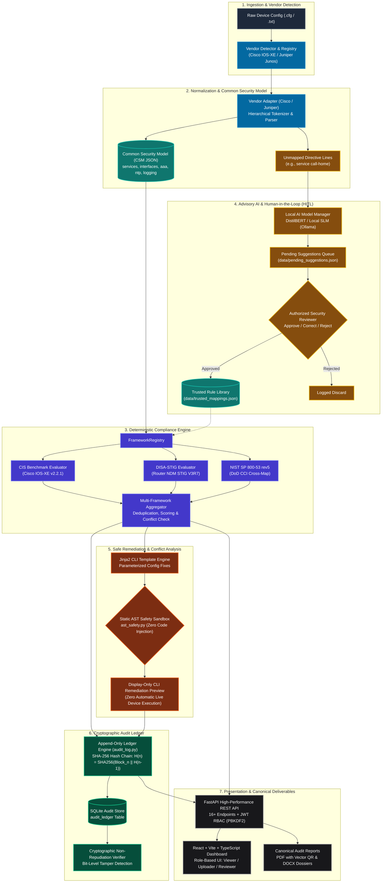

# NTRO PS26155 — Project Review Document & Implementation Status
## AI-Driven Multi-Vendor Network Security Compliance Auditor

**Team:** NextGen | **Problem Statement:** NTRO PS26155 (National Technical Research Organisation)  
**Hackathon:** Smart India Hackathon (SIH) 2026 | **Classification:** Defense-Grade / Sovereign Air-Gapped  
**Current Status:** Production MVP Implemented & Verified | **Automated Tests:** 515+ Passing Backend Tests, 57 Passing Frontend Tests  
**Architecture Decisions:** Formally Recorded in [ADR-001 through ADR-005](decisions/README.md)

---

## 1. Executive Summary & Problem Context

### 1.1 The Challenge (NTRO PS26155)
Mission-critical defense networks, government intranets, and sovereign telecommunications backbones run heterogeneous networking hardware (Cisco, Juniper, Arista). Auditing these configurations presents fundamental challenges:
1. **Syntax Divergence:** Every vendor uses different CLI structures, hierarchical blocks, and semantics.
2. **High Stakes & Zero Trust:** Auditing military/telecom infrastructure requires deterministic mathematical certainty. Unvetted generative AI models cannot be trusted to issue PASS/FAIL verdicts due to hallucinations.
3. **Strict Air-Gap Requirements:** Sensitive operational router configurations cannot be transmitted to commercial cloud LLMs (OpenAI, Anthropic) due to national security regulations.
4. **Remediation Risks:** Blind auto-remediation scripts can sever critical control planes or induce network partition.
5. **Audit Non-Repudiation:** Traditional database logs can be manipulated; compliance requires cryptographically provable tamper evidence.

### 1.2 Our Core Solution Philosophy
> **"Deterministic rules evaluate. Local AI interprets. Authorized humans approve. Nothing touches a live router automatically."**

```
+---------------------------------------------------------------------------------------------------+
|                                     THREE FOUNDATIONAL PILLARS                                    |
+----------------------------------+--------------------------------+-------------------------------+
|     1. DETERMINISTIC CORE        |    2. ADVISORY AI WITH HITL    |   3. MATHEMATICAL PROOF       |
|                                  |                                |                               |
| All compliance verdicts          | Local-only SLMs assist with    | Append-only SHA-256           |
| (PASS / FAIL / UNKNOWN) are 100% | unmapped syntax & plain-text   | hash-chained audit ledger     |
| deterministic Python rules.      | remediation explanations. Zero | provides cryptographic        |
| Zero probabilistic hallucination.| AI makes unapproved decisions. | non-repudiation & tamper check|
| [ADR-001](decisions/ADR-001.md)  | [ADR-003](decisions/ADR-003.md)| [ADR-004](decisions/ADR-004.md)|
+----------------------------------+--------------------------------+-------------------------------+
```

---

## 2. System Architecture & End-to-End Workflows

The platform is structured into **7 decoupled pipeline stages**:



---

## 3. Detailed Operational Workflows

### Workflow 1: Configuration Ingestion & CSM Normalization ([ADR-002](decisions/ADR-002-common-security-model-vendor-abstraction.md))
1. **Upload & Type Checking:** The user submits a raw device configuration via the UI or API (`/api/compliance/upload`).
2. **Vendor Identification:** The engine checks signature directives (`cisco_iosxe`, `juniper_junos`). Fails closed on unrecognized syntax.
3. **Normalization:** The respective `VendorAdapter` parses vendor syntax into a standardized **Common Security Model (CSM)** schema:
   - Global services (SSH, Telnet, HTTP/HTTPS, CDP, LLDP, finger, aux port).
   - AAA authentication, authorization, and accounting configuration.
   - Logging, buffered log levels, syslog hosts, and timestamp accuracy.
   - NTP servers, authentication keys, and access groups.
   - Interfaces, ACL attachments, uRPF, and IP redirects.
4. **Separation of Unmapped Syntax:** Directives not yet mapped into the CSM are isolated into an unmapped queue without failing the parse.

### Workflow 2: Deterministic Rule Evaluation ([ADR-001](decisions/ADR-001-deterministic-compliance-decoupled-from-ai.md))
1. **Framework Dispatch:** The CSM object is passed to selected framework evaluators:
   - **CIS Benchmark:** Cisco IOS-XE 17.x v2.2.1 controls.
   - **DISA-STIG:** Router NDM STIG V3R7 controls.
   - **NIST SP 800-53 rev5:** Mapped via DoD Control Correlation Identifiers (CCIs).
2. **Strict Rule Execution:** Every rule is a deterministic Python function evaluating CSM booleans, integers, or string lists.
3. **Valid States:** Verdicts are restricted to `PASS`, `FAIL`, or `UNKNOWN`. `UNKNOWN` never defaults to `PASS`.
4. **Aggregation & Deduplication:** Overlapping findings across frameworks are consolidated with dual-framework tagging to prevent audit fatigue.

### Workflow 3: Human-in-the-Loop AI Disambiguation ([ADR-003](decisions/ADR-003-human-in-the-loop-ai-unmapped-pipeline.md))
1. **Local-Only Inference:** Unmapped configuration lines (e.g. legacy or proprietary syntax) are routed to local SLM models (`llama3.2:1b`, `qwen2.5:7b`, or DistilBERT). Egress to the internet is strictly blocked ([ADR-005](decisions/ADR-005-air-gapped-local-execution-and-ast-sandboxing.md)).
2. **Suggestion Staging:** The model generates a suggested CSM field mapping, confidence score (0.0 to 1.0), and semantic rationale. Stored in `data/pending_suggestions.json`.
3. **Human Gatekeeper:** A designated Security Reviewer inspects the suggestion queue in the UI.
4. **Promotion:** Only upon explicit reviewer approval is the mapping promoted to `data/trusted_mappings.json`. Future audits instantly run deterministically against the new trusted rule.

### Workflow 4: Safe Remediation & Conflict Detection
1. **Template Generation:** For failed controls, parameterized Jinja2 CLI snippets are compiled (e.g., `no service config`, `ip ssh version 2`).
2. **AST Static Sandboxing:** `ast_safety.py` statically inspects generated code and templates to guarantee zero arbitrary code execution or template injection.
3. **Conflict Detection Engine:** Analyzes proposed remediation blocks against current configuration for:
   - Direct contradictions (e.g., setting conflicting MTU or transport inputs).
   - Shadowing (e.g., duplicate ACL entries).
   - Redundant commands.
4. **Zero Live Execution Policy:** Remediation scripts are display-only previews with CLI copy/download buttons. The system never executes commands over live SSH/Telnet connections.

### Workflow 5: Tamper-Evident SHA-256 Audit Ledger ([ADR-004](decisions/ADR-004-sha256-hash-chained-audit-ledger.md))
1. **Block Assembly:** Every completed audit generates an immutable block containing timestamp, audit ID, device hash, compliance summary, and reviewer identity.
2. **Cryptographic Chaining:**
   $$\text{Block Hash } H_n = \text{SHA-256}(H_{n-1} \parallel \text{AuditID} \parallel \text{Timestamp} \parallel \text{PayloadHash})$$
3. **Genesis Block & Verification:** Genesis block anchors the chain. The `/api/audit-log/verify` endpoint recalculates all hashes sequentially; any single-bit modification immediately reports exact block corruption.

### Workflow 6: Canonical Reporting & Role-Based UI
1. **One Canonical Truth:** A single canonical JSON domain model represents the audit. PDF and DOCX documents are strict export renderings of this canonical model.
2. **Auditable Human Edits:** Reviewers can edit human commentary fields (Executive Summary, Auditor Notes, Recommendations). Immutable facts (verdicts, evidence, hashes) cannot be modified. Every edit records editor identity, timestamp, old value, and new value.
3. **Role-Based Workspaces (RBAC):**
   - **Viewer:** Executive dashboard, compliance posture charts, audit metrics (zero technical clutter).
   - **Uploader:** File ingestion, vendor auto-detection, upload history, parsing status.
   - **Reviewer:** Complete technical workspace: review setup, AI suggestions queue, rule library, remediation analysis, report editing, and export.

---

## 4. Implementation Status Matrix

### 4.1 What Has Been Implemented & Verified (Done)

| Subsystem | Implemented Component | Verification & Evidence | Status |
| :--- | :--- | :--- | :---: |
| **Multi-Vendor Core** | Cisco IOS-XE Parser & Juniper Junos Parser | Unit tests passing across real Cisco and Junos sample configurations | **100% Implemented** |
| **Deterministic Rules** | CIS Benchmark (v2.2.1) & DISA-STIG (V3R7) | Deterministic test assertions across all control categories | **100% Implemented** |
| **Multi-Framework** | NIST SP 800-53 rev5 Cross-Mapping | DoD CCI cross-mapping tables and multi-framework aggregator | **100% Implemented** |
| **Advisory AI** | Local LLM Hardware Discovery & Routing | Hardware-adaptive engine (RAM/VRAM check, auto-fallback, DistilBERT) | **100% Implemented** |
| **HITL Governance** | AI Suggestions Queue & Trusted Rule Library | `pending_suggestions.json` staging to `trusted_mappings.json` approval flow | **100% Implemented** |
| **Remediation Engine** | Jinja2 Templates + Static Conflict Analyzer | Parameterized CLI generation with contradiction and shadowing checks | **100% Implemented** |
| **Security Sandbox** | AST Import & Execution Safety Validator | `ast_safety.py` static syntax tree analysis preventing code injection | **100% Implemented** |
| **Cryptographic Ledger** | SHA-256 Hash-Chained Audit Ledger | Pure Python chained ledger + mathematical non-repudiation verifier | **100% Implemented** |
| **Backend REST API** | FastAPI REST Server (16+ Endpoints) | JWT auth (PBKDF2-SHA256), RBAC, audit lifecycle endpoints | **100% Implemented** |
| **Frontend Application** | React 18 + Vite + TypeScript (14 components) | Role-based screens: Viewer, Uploader, Reviewer, Model Manager, Audit Log | **100% Implemented** |
| **Canonical Reporting** | Report Domain Model + PDF/DOCX Export | PDF generation with verification QR code + DOCX dossier export | **100% Implemented** |
| **Offline Distribution** | `NTRO-PS26155-OFFLINE-DEMO` Package | Standalone offline bundle with `START.bat`, `VERIFY-OFFLINE.bat`, and SHA-256 | **100% Implemented** |

### 4.2 Verified Testing Metrics

```
========================================================================================
                               TESTING & ASSURANCE METRICS
========================================================================================
Total Backend Automated Tests:       515 PASSED (12 skipped for missing optional local GPU)
Frontend Unit & Contract Tests:      57 PASSED (0 failures)
Core 17-Stage Deterministic Loop:    PASSED (tests/test_step5_full_loop.py)
Core 11-Stage REST API Parity Loop:  PASSED (tests/test_api_full_loop.py)
AST Security Injection Tests:        PASSED (tests/test_ast_safety.py)
Deterministic Evaluation Latency:    < 12ms per full device configuration
AI Suggestion Latency (Local SLM):   1.2s - 2.8s (hardware-dependent, non-blocking)
Cryptographic Tamper Sensitivity:    100% detection rate on 1-bit payload modification
========================================================================================
```

---

## 5. What Is Currently Happening & Active Work (Current Sprint)

While the core audit engine and end-to-end flows are fully operational and verified, current work focuses on refining production operations:

1. **Reviewer Workspace UX Consolidation:**
   - Unifying the model selection, framework toggles, findings explorer, AI suggestion queue, and report editor into an integrated, progressive disclosure workspace ([PRD v6 Chunk 3](NTRO_PS26155_PRD_v6_Current_Plan.md)).
2. **Third Vendor Adapter (Arista EOS):**
   - Taking the proven `VendorAdapter` pattern from Juniper and applying it to Arista EOS configurations (staged in `datasets/Arista/`).
3. **Background Asynchronous Job Queue:**
   - Transitioning from synchronous evaluation endpoints to an in-memory / Celery-compatible background queue for large multi-device bulk uploads.
4. **Enhanced Static Conflict Rules:**
   - Broadening the AST and CLI conflict detection matrices to catch cross-interface route-map and BGP peer policy discrepancies.

---

## 6. Explicit Non-Claims & Scope Boundaries

To maintain defense-grade engineering credibility, the system explicitly defines what it **does NOT claim**:

- **No Autonomous Live Device Execution:** The system will never issue commands over SSH/Telnet to live routers. Remediation is strictly display-only.
- **No Probabilistic Compliance Decisions:** Generative AI is never allowed to determine PASS, FAIL, or UNKNOWN. Compliance is 100% deterministic Python code.
- **No Unaudited Rule Modification:** AI suggestions are never directly written into production rule sets without human cryptographic sign-off.
- **No Cloud Dependency:** Zero internet connectivity required. The platform operates 100% air-gapped on premise.
- **No Network Digital Twin Claim:** The current version audits device configurations statically; it does not claim to simulate full network packet reachability.

---

## 7. Mentor Presentation Script & Live Demo Guide (5-Minute Walkthrough)

When presenting to your mentor or evaluation panel, follow this concise script:

### Step 1: The Problem & The Defense-Grade Pitch (1 Minute)
> *"Sir/Ma'am, for NTRO PS26155, our goal was building a sovereign, air-gapped compliance auditor for heterogeneous defense networks. In military and critical infrastructure, two things are non-negotiable: zero cloud egress and zero probabilistic hallucinations. We architected a 3-pillar system: deterministic compliance, local advisory AI with human gatekeeping, and a cryptographically chained audit ledger."*

### Step 2: Show Deterministic Ingestion & Compliance (1.5 Minutes)
> *"Let's upload a raw Cisco IOS-XE configuration. Notice the system auto-detects the vendor and parses it into our Common Security Model (CSM). When we hit evaluate, it runs deterministic Python rules against CIS Benchmark v2.2.1 and DISA-STIG V3R7. Look at the latency: under 12 milliseconds. Every PASS or FAIL cites the exact line in the config and maps to NIST SP 800-53 controls."*

### Step 3: Show Advisory AI & Human-in-the-Loop Review (1 Minute)
> *"Now, what happens when an engineer uses unfamiliar or proprietary commands? Our local SLM running on Ollama interprets the unmapped line. But notice: it does not change the compliance score. It stages a suggestion to the Pending Suggestions queue. As the authorized reviewer, I inspect the rationale and confidence score. Only when I click 'Approve' does it enter our Trusted Rule Library for all future audits."*

### Step 4: Show Safe Remediation & Non-Repudiation Ledger (1 Minute)
> *"For failed controls, our Jinja2 engine generates CLI remediation blocks. Before displaying, `ast_safety.py` inspects the code to guarantee no injection, and our static analyzer checks for rule contradictions. Finally, look at our Audit Ledger: every audit is SHA-256 hash-chained to the previous block. If anyone alters even a single character in the audit database, our cryptographic verifier instantly flags the tampered block."*

### Step 5: Wrap-up & Test Evidence (30 Seconds)
> *"The backend is fully implemented with 515 passing automated tests, 57 frontend tests, and complete documentation including 5 formal Architecture Decision Records (ADRs). We also packaged an offline demonstration distribution with one-click verification."*

---

## 8. Mentor Q&A Defense Sheet

| Potential Mentor Question | Authoritative Architectural Response |
| :--- | :--- |
| **"Why not just use an LLM like GPT-4 to read the config and tell you if it's compliant?"** | Generative LLMs hallucinate, suffer from non-deterministic outputs, and sending defense configs to cloud APIs violates air-gap security. Our core compliance engine is 100% deterministic Python code. Local AI is used strictly as an advisory assistant for interpreting unmapped syntax. |
| **"How does the system handle multiple vendors without rewriting all rules?"** | Through our **Common Security Model (CSM)** layer ([ADR-002](decisions/ADR-002-common-security-model-vendor-abstraction.md)). Each vendor adapter maps raw syntax into standard CSM JSON structures. The compliance engine evaluates rules against CSM, decoupling vendor syntax from security logic. |
| **"What prevents an AI hallucination from weakening network security?"** | The AI has **zero write permission** to compliance states or trusted rules ([ADR-001](decisions/ADR-001.md), [ADR-003](decisions/ADR-003.md)). Its suggestions remain in an untrusted staging queue (`pending_suggestions.json`) until an authenticated human reviewer explicitly verifies and signs off. |
| **"Why not auto-deploy the remediation scripts to routers via SSH?"** | In national security infrastructure, automated execution risks network disruption or outages. Our policy is strictly **display-only remediation** with static conflict analysis ([ADR-005](decisions/ADR-005.md)). The network administrator maintains complete operational control. |
| **"How do you prove an audit report wasn't altered after the fact?"** | Through our **SHA-256 hash-chained audit ledger** ([ADR-004](decisions/ADR-004.md)). Each audit block cryptographically incorporates the hash of the preceding block. Running our cryptographic verification recalculates the chain and detects any unauthorized database tampering down to the bit level. |

---

*Document compiled in alignment with NTRO PS26155 PRD v6.0 and formal Architecture Decision Records ADR-001 through ADR-005.*
